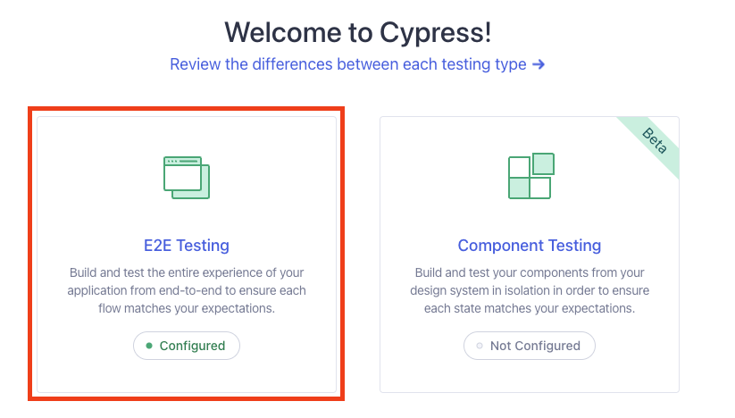
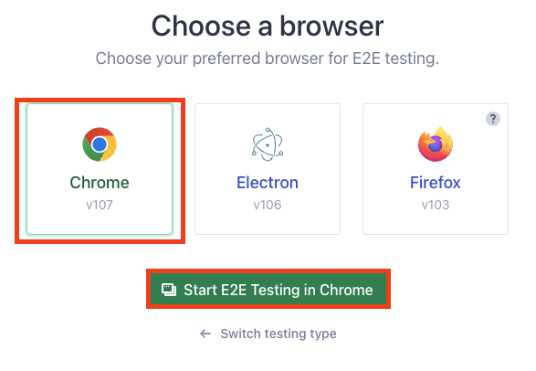
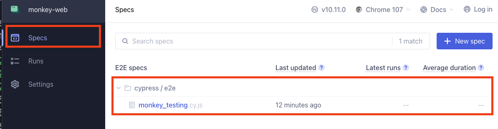
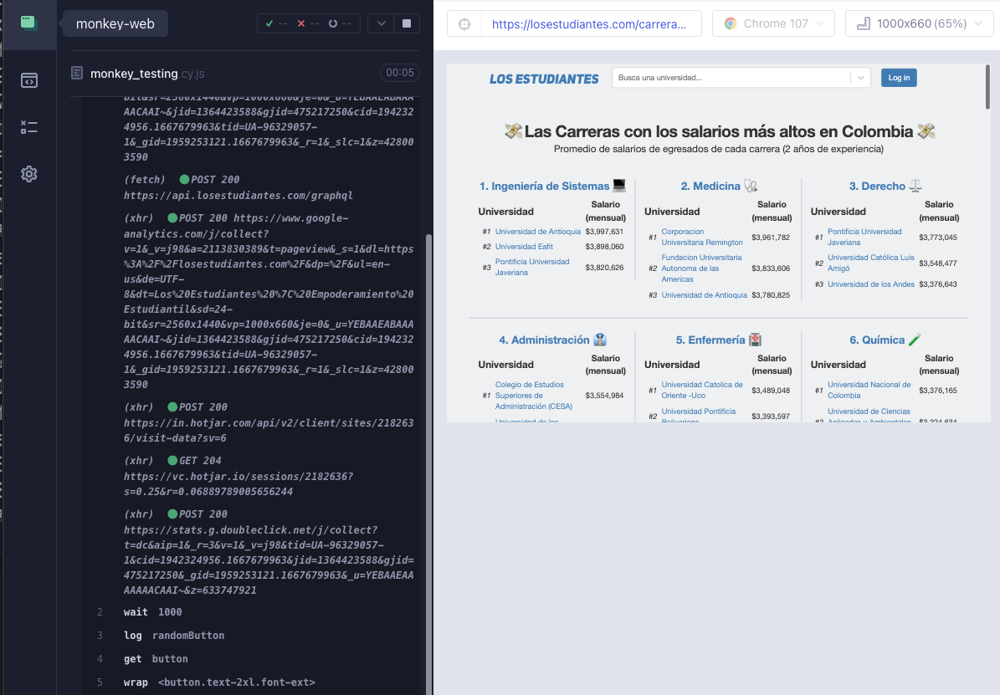

# Monkey losestudiantes.com

## Pre-requisitos

1. Instalar Node.js (usando nvm)

```bash
nvm install
```

Nota: Si no se cuenta con nvm, instalar Node.js de forma manual, la versión usada se encuentra en el archivo `.nvmrc`

2. Instalar dependencias

```bash
npm install
```

## Pasos para correr el monkey

1. Correr el monkey

```bash
npm start
```

2. Se abrirá la aplicación de Cypress. Seleccionar la opción `E2e Testing`.
   

3. Se pedirá seleccionar el navegador en el que se quiere correr el monkey. Seleccionar `Chrome`.
   

4. Se abrirá una nueva ventana de Chrome. Ir a la pestaña de `Specs` y seleccionar el
   archivo `cypress/e2e/monkey_testing.cy.js`.
   

5. Se ejecutará el monkey. Se puede ver el progreso en el navegador.
   